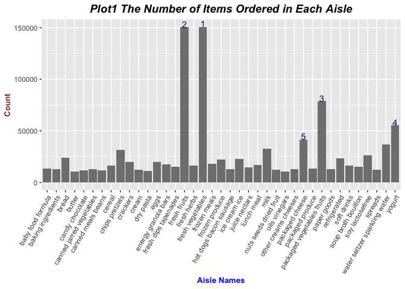
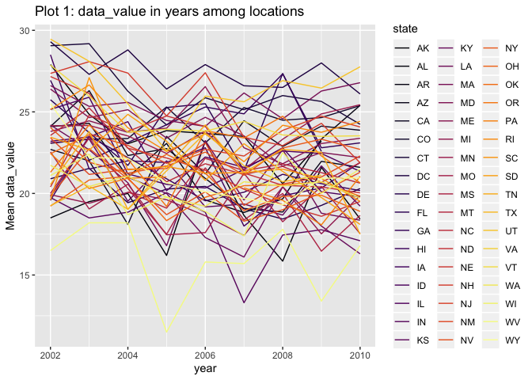
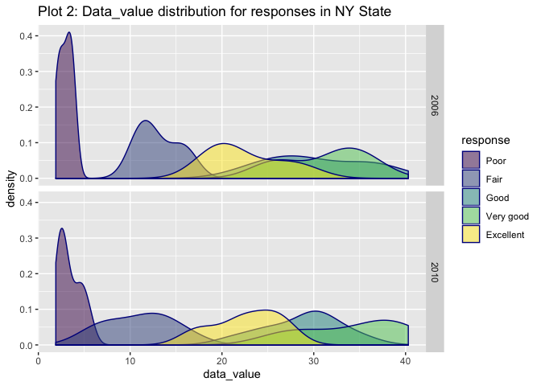
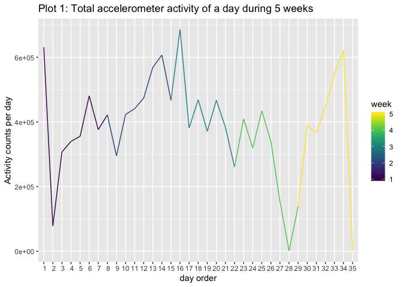
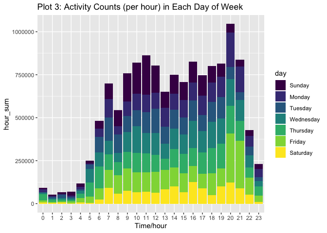

p8105\_hw3\_ym2771
================
Yuqi Miao
10/4/2019

# Problem 1

``` r
library(p8105.datasets)
data("instacart")
library(tidyverse)
library(viridis)
```

``` r
instacart <- instacart %>% 
    janitor::clean_names() %>% 
    distinct() 
instacart %>% 
    group_by(user_id) %>% 
    summarize(count = n(), order_number = mean(order_number), order_dow = mean(order_dow),order_hour_of_day = mean(order_hour_of_day), reorder = sum(as.numeric(reordered)), days_before_prior_purchase = mean(days_since_prior_order) )
```

    ## # A tibble: 131,209 x 7
    ##    user_id count order_number order_dow order_hour_of_d… reorder
    ##      <int> <int>        <dbl>     <dbl>            <dbl>   <dbl>
    ##  1       1    11           11         4                8      10
    ##  2       2    31           15         1               11      12
    ##  3       5     9            5         0               11       4
    ##  4       7     9           21         2               11       8
    ##  5       8    18            4         1               14       4
    ##  6       9    22            4         6               10      22
    ##  7      10     4            6         0               19       0
    ##  8      13     5           13         0               21       4
    ##  9      14    11           14         2               19       8
    ## 10      17     6           41         3               10       3
    ## # … with 131,199 more rows, and 1 more variable:
    ## #   days_before_prior_purchase <dbl>

## Description of the dataset

The instavart dataset with 1384617 observations and 15 variables gives
order information for 131209 users, who only have single order
respectively.

The information focus on the following dimension: **firstly**, detailed
order information, including `order composition`(suggested by
product\_id, product\_name, aisle\_id, department\_id, aisle,
department), and `order time` (accurate to hour, suggested by variables
order\_dow, order\_hour\_of\_day); **secondly**, the users’ order
frequency, which is illustrated by `order sequence number for the
specific user`(suggested by order\_number) and `shopping
interval`(suggested by days\_since\_prior\_order); **thirdly**, users
shopping preferrence can also be analysed by the `order adding to cart`
and `reorder information`(suggested by add\_to\_cart\_order,
reordered,respectively).

For example, for user 1,this dataset shows that he/she got is his/her
11th order at 8AM on Thursday, and the order was comprised of 11
products with detailed information about products, aisles and
departments, among which 10 products are reordered 14 days
before.

## Analysis

### How many aisles are there, and which aisles are the most items ordered from?

``` r
instacart_aisle <- 
    instacart %>% 
    group_by(aisle_id,aisle) %>% 
    summarise(count = n()) %>% 
    arrange(desc(count)) %>% 
    filter(count >= 10000) %>% 
    ungroup() %>% 
    mutate(rank = row_number(),label = ifelse(as.numeric(rank) > 5,'',as.character(rank)))

g <- 
    ggplot(data = instacart_aisle, aes(x = aisle, y = count,label = label )) +
    geom_bar(stat="identity",fill = "grey50") +
    theme(
        axis.text.x = element_text(angle = 60,hjust = 1),
        plot.title = element_text(color="black", size=14, face="bold.italic",hjust = 0.5),
        axis.title.x = element_text(color="blue", size=10, face="bold"),
        axis.title.y = element_text(color="#993333", size=10, face="bold")
        )+
    geom_text(vjust = 0,color = "darkblue") + 
    ggtitle( "Plot1 The Number of Items Ordered in Each Aisle")+ 
    xlab("Aisle Names")+
    ylab ("Count")
g   
```

<!-- -->

### comments:

In dataset instacart, there are 134 aisles in total. There are 39 aisles
bigger than 10,000 in total and the top5 most popular aisle are fresh
vegetables, fresh fruits, packaged vegetables fruits, yogurt, packaged
cheese, reflecting the most urgent demands of online-shopping customers.
As shown in the plot, fresh vegetables, fresh fruits are extremely
popular, the counts of this two aisles are nearly 150,000, far more
larger than the latter ranks.

### Make a table showing the three most popular items in three aisles

``` r
instacart_3aisle_table <- 
    instacart %>% 
    group_by(aisle,product_name) %>% 
    summarise(count = n()) %>% 
    mutate(rank = min_rank(desc(count))) %>% 
    filter(aisle %in% c( "baking ingredients", "dog food care","packaged vegetables fruits")) %>%
    filter(rank <= 3) %>% 
    arrange(aisle, rank)
knitr::kable(instacart_3aisle_table, caption = "Table 1: The most popular products in 3 aisles: baking ingredients, dog food care,packaged vegetables fruits")
```

| aisle                      | product\_name                                 | count | rank |
| :------------------------- | :-------------------------------------------- | ----: | ---: |
| baking ingredients         | Light Brown Sugar                             |   499 |    1 |
| baking ingredients         | Pure Baking Soda                              |   387 |    2 |
| baking ingredients         | Cane Sugar                                    |   336 |    3 |
| dog food care              | Snack Sticks Chicken & Rice Recipe Dog Treats |    30 |    1 |
| dog food care              | Organix Chicken & Brown Rice Recipe           |    28 |    2 |
| dog food care              | Small Dog Biscuits                            |    26 |    3 |
| packaged vegetables fruits | Organic Baby Spinach                          |  9784 |    1 |
| packaged vegetables fruits | Organic Raspberries                           |  5546 |    2 |
| packaged vegetables fruits | Organic Blueberries                           |  4966 |    3 |

Table 1: The most popular products in 3 aisles: baking ingredients, dog
food care,packaged vegetables fruits

### comments:

**Firstly**, there are huge differences among the demands of aisles, the
maximum overall demand is for packaged vegetables fruits, then baking
ingredients, and minimum for dog food care.

**Secondly**, the difference within aisles varies. As for packaged
vegetables fruits, the demand for Organic Baby Spinach is extremely
high, up to roughly twice as much as the second rank product in this
aisle, and the difference between 2nd and 3rd rank is moderately
smaller; As for baking ingredients, the demand for Light Brown Sugar is
also significantly greater than the demand for second and third rank; As
for dog food care, the demand differences among 3 ranks is not that
significant.

### Table of mean hour of the day at which Pink Lady Apples and Coffee Ice Cream are ordered on each day of the week

``` r
weekdays <- c("Sun","Mon","Tue","Wed","Thu","Fri","Sat")
purchase_hour_of_weekday <- 
    instacart %>%
    arrange(order_dow) %>% 
    mutate(order_dow = weekdays[order_dow+1]) %>% 
    filter(product_name %in% c("Pink Lady Apples","Coffee Ice Cream")) %>% 
    group_by(product_name,order_dow) %>% 
    summarise(mean_how = round(mean(order_hour_of_day),2)) %>% 
    pivot_wider(names_from = order_dow, values_from = mean_how) %>%
    select(product_name,weekdays)
knitr::kable(purchase_hour_of_weekday, caption = "Table 2: mean hour of the day at which Pink Lady Apples and Coffee Ice Cream are ordered")
```

| product\_name    |   Sun |   Mon |   Tue |   Wed |   Thu |   Fri |   Sat |
| :--------------- | ----: | ----: | ----: | ----: | ----: | ----: | ----: |
| Coffee Ice Cream | 13.77 | 14.32 | 15.38 | 15.32 | 15.22 | 12.26 | 13.83 |
| Pink Lady Apples | 13.44 | 11.36 | 11.70 | 14.25 | 11.55 | 12.78 | 11.94 |

Table 2: mean hour of the day at which Pink Lady Apples and Coffee Ice
Cream are ordered

## comments:

This mean purchase hour of this two products are distributed near
mid-day. As for Coffee Ice Cream, there is a clear trend that purchase
hour would be earlier when near weekend than mid-week; For Pink Lady
Apples, the purchase hour fluctuated without clear format, people tend
to buy this product later in Wednesday, sunday and Friday.

# Problem 2

``` r
data("brfss_smart2010")
```

## Data cleaning:

``` r
brfss_overall_health <- 
    brfss_smart2010 %>%
    janitor::clean_names() %>% 
    filter(topic == "Overall Health", response %in% c("Excellent", "Very good", "Good", "Fair", "Poor")) %>%
    mutate(state = factor(locationabbr), location = locationdesc, response = factor(response,levels = c("Poor","Fair","Good","Very good","Excellent" ), ordered = T)) %>% 
    select(year, state, location, everything(), -locationabbr, -locationdesc)
```

### Data description:

In the total dataset, there are 10625 observations and 23 variables. In
this analysis, the key variables are year, state, location, data\_value
and
response.

## Exploratary analysis

### In 2002, which states were observed at 7 or more locations? What about in 2010?

``` r
states_with_7m <- 
    brfss_overall_health %>% 
    group_by(year, state) %>% 
    summarise(count = n_distinct(location)) %>% 
    filter(count >= 7, year %in% c(2010,2002)) %>% 
    pivot_wider(names_from = year, values_from = count )

knitr::kable(states_with_7m, caption = "Table 1: States were observed at 7 or more locations in 2002 and 2010")
```

| state | 2002 | 2010 |
| :---- | ---: | ---: |
| CT    |    7 |   NA |
| FL    |    7 |   41 |
| MA    |    8 |    9 |
| NC    |    7 |   12 |
| NJ    |    8 |   19 |
| PA    |   10 |    7 |
| CA    |   NA |   12 |
| CO    |   NA |    7 |
| MD    |   NA |   12 |
| NE    |   NA |   10 |
| NY    |   NA |    9 |
| OH    |   NA |    8 |
| SC    |   NA |    7 |
| TX    |   NA |   16 |
| WA    |   NA |   10 |

Table 1: States were observed at 7 or more locations in 2002 and 2010

### Comment

In 2002, there are overall 6 states having 7 or more locations, while in
2010, the number of states having 7 or more locations had increased to
14, and the overlapping states are FL, MA, NC, NJ, PA

## data\_value plot across locations

``` r
data_value_plot_data <- 
    brfss_overall_health %>% 
    filter(response == "Excellent") %>% 
    group_by(year, state) %>% 
    summarise(mean_data_value = mean(data_value)) 
g <- 
    ggplot(data = data_value_plot_data,aes(x = year, y = mean_data_value, color = state)) +
    geom_line() + 
    scale_color_viridis(discrete = TRUE,option = "B")+
    labs(title = "Plot 1: data_value in years among locations", y = "Mean data_value")
g
```

    ## Warning: Removed 3 rows containing missing values (geom_path).

<!-- -->

### comment

As shown in the figure, the mean data\_value for different years varies
differently among states. The overall trend of the data\_value of years
among states are decreasing. The range of mean data\_value of years
among states is (11.5, 29.46), where the minmum value is from WV in year
2005, and the maximum value comes from UT in year2002.

### Data\_value distribution for responses in NY State

``` r
dv_resp_plot_data <- 
    brfss_overall_health %>%  
    filter(year %in% c(2006,2010), state == "NY") %>% 
    mutate(year = factor(year))
g <- 
    ggplot(dv_resp_plot_data, aes(x = data_value,fill = response)) +
    facet_grid(rows = vars(year))+
    geom_density( color = "darkblue",alpha = 0.5)+
    labs(title = "Plot 2: Data_value distribution for responses in NY State")
g
```

<!-- -->

### comment

As shown above, the distributions of data\_value among different
responses vary significantly. Among which, the data\_value distribution
of “poor” response has the smallest mean value and smallest variance,
and data value of other categories has much wider distributions. In
2006, data value distribution of “poor” response is greatly separated
with other response categories, while in 2010, the mean value of “fair
response is decreasing and overlapped with”poor" response.

# Problem 3

``` r
weekend <- c("Sunday","Saturday")
weekdays <- c("Sunday","Monday","Tuesday","Wednesday","Thursday","Friday","Saturday")
accelerometer_chf <- 
    read_csv('data/accel_data.csv') %>% 
    janitor::clean_names() %>% 
    pivot_longer(cols = 4:1443, names_to = "activity",names_prefix = "activity_", values_to = "activity_count") %>% 
    mutate(
        week_day_vs_weekend = factor(ifelse(day %in% weekend, "weekend","weekdays")),
        activity = factor(activity, levels = 1:1440), 
        day = factor(day, levels = weekdays, order = T),
        week = factor(week)
        ) %>% 
    arrange(week,day) %>% 
    mutate(day_order = row_number() %/% 1440 + 1) %>% 
    select(week,day_order,day,week_day_vs_weekend,everything())
```

    ## Parsed with column specification:
    ## cols(
    ##   .default = col_double(),
    ##   day = col_character()
    ## )

    ## See spec(...) for full column specifications.

### Describe the resulting dataset

This dataset contains the counts of accelerometer activity for every
miute of a 24-hour day in 5 weeks, with 50400 rows(minutes) and 7
columns. The variables in the dataset are week, day\_order, day,
week\_day\_vs\_weekend, day\_id, activity, activity\_count.

## The total activity over the day

``` r
accelerometer_chf_total <- 
    accelerometer_chf %>% 
    group_by(week,day) %>% 
    summarise(sum_activity = sum(activity_count),day_order = mean(day_order))
   
acc_total_table <- accelerometer_chf_total %>%
    select(-day_order) %>% 
    pivot_wider(names_from = day, values_from = sum_activity)
knitr::kable(acc_total_table, caption = "Table 1: Total Activity for Each Day")
```

| week | Sunday |    Monday |  Tuesday | Wednesday | Thursday |   Friday | Saturday |
| :--- | -----: | --------: | -------: | --------: | -------: | -------: | -------: |
| 1    | 631105 |  78828.07 | 307094.2 |    340115 | 355923.6 | 480542.6 |   376254 |
| 2    | 422018 | 295431.00 | 423245.0 |    440962 | 474048.0 | 568839.0 |   607175 |
| 3    | 467052 | 685910.00 | 381507.0 |    468869 | 371230.0 | 467420.0 |   382928 |
| 4    | 260617 | 409450.00 | 319568.0 |    434460 | 340291.0 | 154049.0 |     1440 |
| 5    | 138421 | 389080.00 | 367824.0 |    445366 | 549658.0 | 620860.0 |     1440 |

Table 1: Total Activity for Each Day

``` r
g <- 
    ggplot(data = accelerometer_chf_total, aes(x = day_order, y = sum_activity, color = as.numeric(week))) +
    geom_line() +
    scale_x_discrete(name = "day order", limits = 1:35) +
    labs(title = "Plot 1: Total accelerometer activity of a day during 5 weeks", y = "Activity counts per day", color = "week") +
    scale_color_viridis()
g
```

<!-- -->

### comment

As shown in the table and graphs, the range of the daily activity is
(1440, 6.859110^{5}), and the total activity of the accelerometer varies
greatly among days. Variance between day 3 to day 27 is relevantly
small, while the variance between the first 3 days and between day 27 to
day 35 is extremely large, if collecting data in longer period, we may
find a fluctuation period of daily activities sum.

Accelerometer data allows the inspection activity over the course of the
day. Make a single-panel plot that shows the 24-hour activity time
courses for each day and use color to indicate day of the week. Describe
in words any patterns or conclusions you can make based on this graph.

``` r
accelerometer_chf %>% 
    ggplot(aes(x = activity, y = activity_count, color = day)) +
    geom_line(alpha = 0.4) +
    scale_x_discrete(name = "Time/min", breaks = seq(1,1440,120))+
    labs(title = "Plot 2: Activity Counts (per minute) in Each Day of Week")+
    scale_fill_brewer(palette="Set2")
```

<!-- -->

``` r
accelerometer_chf %>% 
    mutate(hour = factor(cut(as.integer(activity), breaks = seq(0,1440, by = 60)), labels = 0:23,ordered = T)) %>% 
    group_by(week,day,hour) %>% 
    summarise(hour_sum = sum(activity_count)) %>% 
    ungroup %>% 
    ggplot(aes(x = hour, y =hour_sum)) +
    geom_bar(stat = "identity",aes(fill = day)) +
    scale_x_discrete(name = "Time/hour",)+
    labs(title = "Plot 3: Activity Counts (per hour) in Each Day of Week")+
    scale_color_viridis(discrete = T)
```

<!-- -->

### comment

As shown in two plots above, the activity counts of the accelerometer is
low during 0am to 4am, which may indicate that during the deep sleep
period, the activity frequency of accelerometer is relatively low;
during 9am to 11 am, the activity frequency reach the first peak, which
may indicate that during the morning work period, the object we
investigate has more highly-motivated activities; during lunch
time(11am-2pm), the activity counts are relatively low, which may
indicates the mid-day breaks; during afternoon(2pm-5pm), the activity is
growing again, but not as high as the morning peak; The highest activity
counts falls in night(8pm-9pm), which may indicate that the object has
the most Vigorous Activities at early night. There are also day to day
variance among weekdays, as shown in plot 2, in sunday, the activity
peak is at around 10am.
